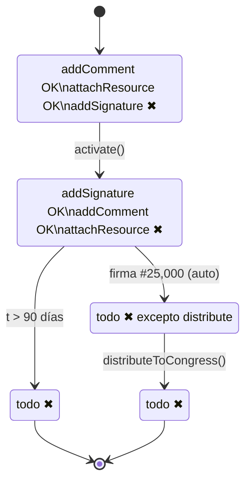
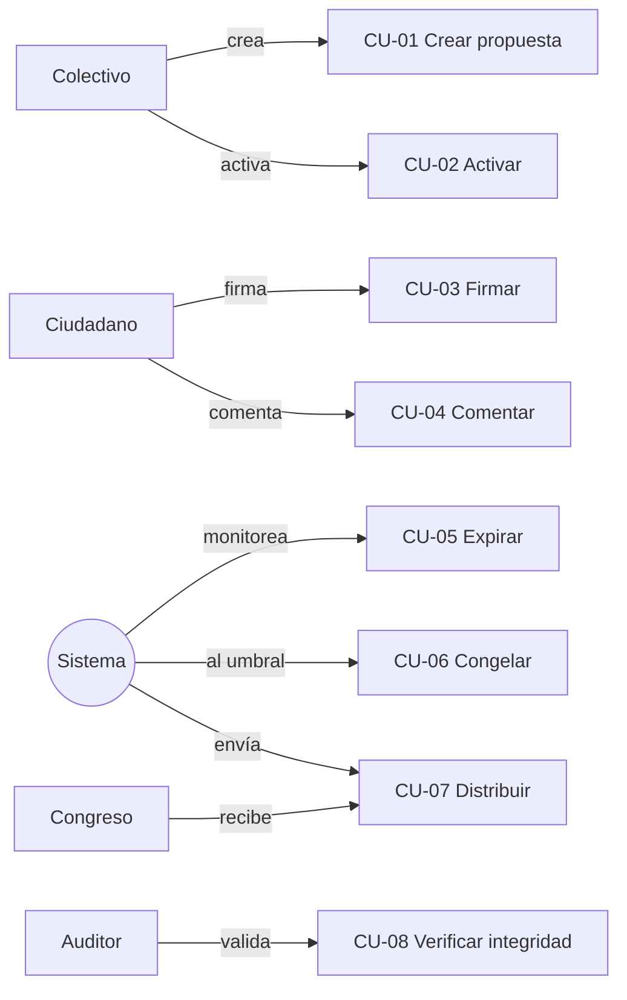
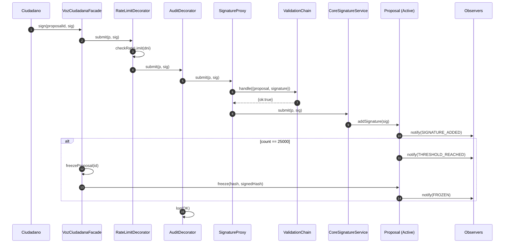
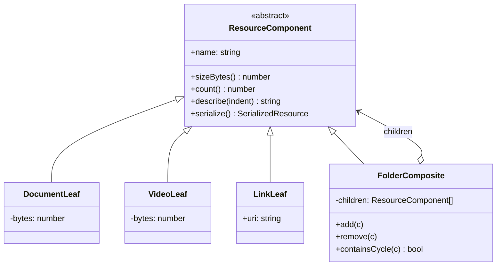
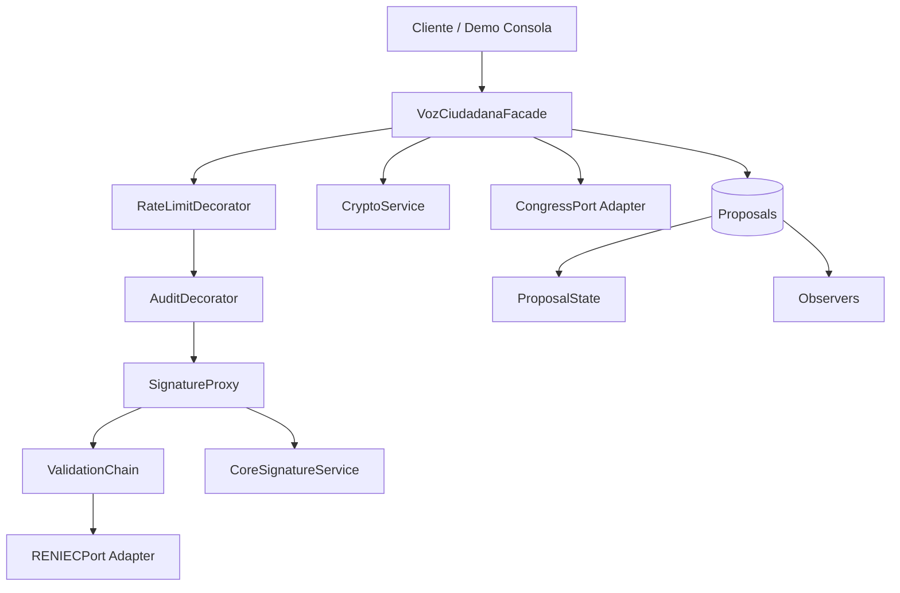

# Diagramas — Voz Ciudadana

## 1. Diagrama de Estados (State Pattern)

## 2. Casos de Uso

## 3. Flujo de firma — Secuencia (Proxy + Chain + Decorator)

## 4. Composite — Recursos

## 5. Facade — Composición de subsistemas

